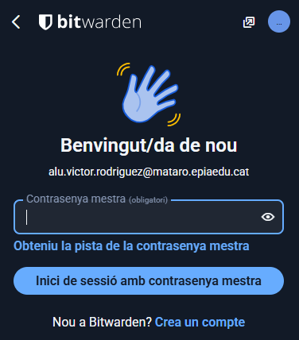
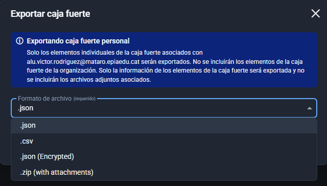
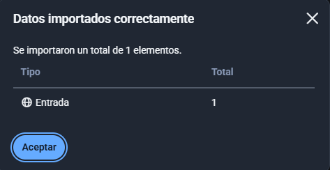

# Guia Tècnica: Fent ús de Bitwarden
**Data:** 21/10/2025  
**Autor:** Víctor Rodríguez Amills | SMX2B | Seguretat informàtica  

## Índex (fes clic per anar a la secció)
1. [Instal·lació i Configuració Inicial](#1-instal·lació-i-configuració-inicial)  
2. [Generació de Contrasenyes Segures](#2-generació-de-contrasenyes-segures)  
3. [Exemples d'Ús i Emplenament Automàtic](#3-exemples-dús-i-emplenament-automàtic)  
4. [Gestió de Còpies de Seguretat (Backup)](#4-gestió-de-còpies-de-seguretat-backup)

---

## 1 Instal·lació i Configuració Inicial

El primer pas és **accedir a la pàgina oficial de Bitwarden**, des d’on **descarregarem el gestor de contrasenyes**.

Un cop dins de la web, **ens dirigim a l’apartat Downloads**, on podem **descarregar el fitxer .exe** per al nostre sistema operatiu, en aquest cas **Windows 11**.

Aquí **seleccionem l’instal·lador estàndard**, anomenat **Bitwarden-Installer.exe**.

Quan el fitxer s’hagi descarregat, **l’executem** i se’ns obrirà una finestra en la qual haurem de **seguir els passos indicats** per completar la instal·lació.

**Seleccionem l’opció d’instal·lar-lo només per al nostre usuari** i tot seguit **començarà la instal·lació**.

Un cop finalitzada, **premem Finish** per tancar l’instal·lador.

En **entrar a Bitwarden per primera vegada**, apareix el **panell d’inici de sessió**, on haurem de **fer clic a Crea un compte**.

A continuació, se’ns demanarà **el nom i el correu electrònic** que volem utilitzar.

Després de prémer **Continua**, **rebrem un correu electrònic** per continuar amb el procés de creació del compte.

En aquest correu, **verifiquem l’adreça de correu electrònic**.

Amb l’email verificat, només queda **definir la contrasenya mestra**.

Un cop completats tots aquests passos, **el compte ja estarà creat**, i només ens quedarà **iniciar sessió a Bitwarden**.

**Introduïm la contrasenya**.

I **finalment**, un cop **iniciada la sessió**, **podrem veure el menú principal de Bitwarden**, des d’on **gestionarem totes les nostres contrasenyes**.

---

## 2 Generació de Contrasenyes Segures

Una vegada **Bitwarden està instal·lat i configurat**, hem d’aprendre a **utilitzar el generador de contrasenyes**.

Per **crear una nova entrada**, hem de **fer clic al botó +**.

A continuació, **podrem escollir entre els diferents tipus d’entrada** que volem crear.

En aquest cas, **crearem una entrada d’Inici de sessió**, que és la més habitual.

Apareixeran diversos camps per completar:

- **Nom de l’element:** és el nom amb què volem guardar l’entrada.
- **Carpeta:** opcional, per agrupar diferents entrades i mantenir-les més organitzades.
- **Nom d’usuari:** podem introduir-ne un manualment o generar-lo automàticament des del mateix Bitwarden.

Un cop definit el nom d’usuari, **generem la contrasenya**. Bitwarden permet **personalitzar diversos paràmetres**, com la **longitud**, l’ús de **caràcters especials**, **majúscules o números**, per així **millorar la seguretat** de la contrasenya.

---

## 3 Exemples d'Ús i Emplenament Automàtic

Per a **entendre millor el funcionament de Bitwarden**, crearem una **entrada per desar les credencials** del nostre compte de **Gmail**.

D’aquesta manera, només haurem **generat l’entrada per copiar i enganxar manualment** les credencials. No obstant això, perquè **Bitwarden pugui autocompletar-les** en una aplicació o servei web, haurem d’**afegir el lloc web** on volem que s’autocompletin.

Tot i això, **aquests passos no són suficients** perquè l’autocompletat funcioni automàticament. Per aconseguir-ho, cal **instal·lar l’extensió de Bitwarden** al nostre navegador.

En el cas de **Google Chrome**, ens dirigirem a la **Chrome Web Store** i **buscarem l’extensió de Bitwarden**.

Una vegada instal·lada, haurem d’**iniciar sessió amb el nostre compte** prèviament creat. El primer pas és **introduir el correu electrònic** amb què ens vam registrar per accedir a la **caixa forta**.

A continuació, introduirem la **contrasenya mestra** creada anteriorment.

Per motius de seguretat, Bitwarden ens **enviarà un correu electrònic amb un codi de verificació** per confirmar la nostra identitat.

Un cop **introduït el codi de verificació**, ja tindrem **accés a la nostra caixa forta des de l’extensió**.

Finalment, si anem al **panell d’inici de sessió de Gmail**, en introduir el camp del correu electrònic, **Bitwarden mostrarà l’opció d’autocompletar** les credencials que hem desat prèviament.

---

## 4 Gestió de Còpies de Seguretat (Backup)

Una vegada tenim diverses entrades registrades a **Bitwarden**, és recomanable **fer una còpia de seguretat** de la caixa forta amb totes les credencials. Per fer-ho, seguirem els passos següents:

Ens dirigim a la part superior esquerra, a l’apartat **Archivo**, i fem clic a **Exportar caja fuerte**.

Un cop ho fem, apareixerà una finestra on podrem **escollir el format** amb què volem exportar la nostra caixa forta.

En aquest cas, seleccionarem el format **.json** i, tot seguit, farem clic a **Exportar caja fuerte** per iniciar el procés d’exportació.

A continuació, **Bitwarden ens demanarà la contrasenya mestra** per verificar la nostra identitat.

Després d’introduir-la, ens preguntarà **on volem guardar l’arxiu exportat**.

Un cop exportada la caixa forta, per **importar-la** de nou només cal anar a **“Archivo”** i a **“Importar datos”**.

En aquesta finestra, haurem de **seleccionar la caixa forta existent** on volem afegir les entrades, **escollir el tipus de format** utilitzat en l’exportació (en aquest cas, **.json**) i **adjuntar l’arxiu**. Finalment, farem clic a **“Importar datos”** per completar el procés.

Quan la importació s’hagi realitzat correctament, **Bitwarden mostrarà una notificació** indicant el nombre d’entrades importades a la nostra caixa forta.

És **altament recomanable** emmagatzemar aquest arxiu **.json** en un **dispositiu USB xifrat** o bé en un **servei d’emmagatzematge al núvol amb xifratge**, per garantir una major seguretat de les credencials.

[Tornar a enunciat](README.md)
